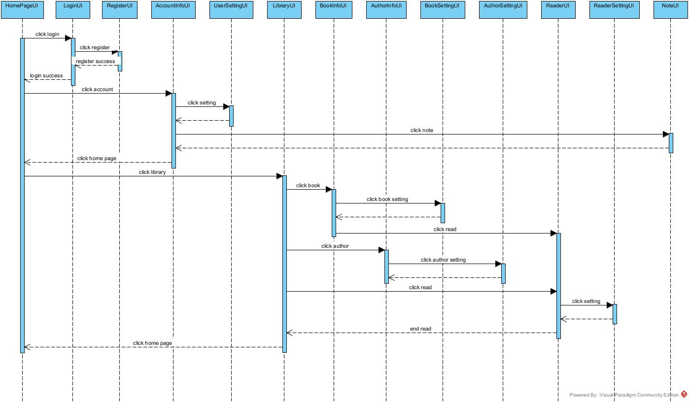

# 1. 软件体系结构设计

该软件系统大致可分为“阅读平台(LibraryApp)”子系统和“阅读器(ReaderApp)”子系统。前者的职责是提供用户注册、登录和管理服务，实现图书展示、图书搜索、图书分类功能，实现用户对图书的收藏、评价，以及管理员对图书的上架、下架、修改等功能；后者的职责是提供基本的阅读功能，包括上下翻页、字体大小调整、背景切换功能，同时为用户提供添加书签、笔记、高亮的功能。

图1 “怡心阅读”系统的体系结构图

- “阅读平台(LibraryApp)”子系统
它负责接收使用者的登录和注册请求，对用户进行管理，实现图书的信息展示、按搜索结果展示、按分类展示、按评价展示等不同展示方式，实现用户对图书的收藏和评价，实现管理员对图书的上架和下架。

- “阅读器(ReaderApp)”子系统
它负责提供图书内容的按页展示功能，实现阅读器的上下翻页，字体大小调整、背景切换等外观调整功能，且为用户提供添加书签、笔记和高亮的功能，记录用户的阅读行为等。该子系统依赖于“阅读平台(LibraryApp)”子系统

图2和图3分别描述了“阅读平台(LibraryApp)”子系统和“阅读器(ReaderApp)”子系统的设计架构，图中界面层和业务逻辑层的类来自于需求用例模型和用例交互模型，且作为下文详细模型设计中类设计的参考。基础服务层中，前端使用Vue框架，后端使用SpringBoot框架，并使用MySQL操作数据库。

图2 “阅读平台(LibraryApp)”子系统的设计架构

图3 “阅读器(ReaderApp)”子系统的设计架构

# 2. 用户界面设计

根据用例描述以及每个用例的交互图，可以发现该软件系统有以下一组界面以支持用户的操作。

- 登录界面“LoginUI”：帮助用户输入用户信息以登录到系统之中。
- 注册界面“RegisterUI”：帮助用户注册账号，以便登录账号。
- 用户信息设置界面“UserSettingUI”：帮助用户设置用户的信息。
- 账户中心界面“AccountInfoUI”：显示账户的基本信息，以及用户收藏图书、用户笔记、会员管理等信息。
- 精品页界面“HomePageUI”：精品页是访问网站的起始点，显示用户已经添加的书籍和最近阅读的章节，以方便用户直接进行阅读。该页面还显示推荐的书籍以及榜单等功能。
- 图书馆界面“LibraryUI”：显示书库中所有的书籍的基本信息，并提供分类查找功能，以便用户查找想阅读的书籍，并添加到收藏中。
- 图书信息界面“BookInfoUI”：显示图书的作者、简介等信息。
- 作者信息界面“AuthorInfoUI”：显示作者的简介、作品等信息。
- 图书信息设置界面“BookSettingUI”：帮助图书管理员设置图书的信息。
- 作者信息设置界面“AuthorSettingUI”：帮助图书管理员设置作者的信息。
- 阅读器界面“ReaderUI”：帮助用户阅读，提供上下翻页、字体大小调整、背景切换等功能。
- 阅读器设置界面“ReaderSettingUI”：帮助用户在阅读时进行字体大小调整、背景切换等设置。
- 笔记界面“NoteUI”：显示用户所有的笔记的基本信息。

图4 描述用户界面跳转关系的顺序图

# 3.用例设计

## （1）“用户注册”用例实现的设计方案

“用户注册”功能的实现主要是通过“RegisterUI”对象中的register服务先判断输入账号密码是否合法，再通过“UserDB”对象提供的服务，查询数据库中是否有用户输入的账号和邮箱信息，从而来判定该用户的身份是否合法。

 

首先，用户进入边界类注册页面“RegisterUI”，随后对该对象控制类“RegisterManager”发消息“Register(account, password, email)”来请求注册用户，同时检验输入是否合法，接受到请求后控制类向实体类“UserDB”对象发消息RegistercheckUser(account, password, email)判断用户邮箱、账号是否已存在，随后将结果一步步返回并回到注册页面。

## （2）“用户登录”用例实现的设计方案

“用户登录”功能的实现主要是通过“UserDB”对象提供的服务，查询数据库中是否有用户输入的账号和密码信息，从而来判定该用户的身份是否合法。

 

首先，用户进入边界类登录页面“LoginUI”，随后对该对象控制类“LoginManager”发消息“login(account, password)”来请求登录用户，同时检验输入是否合法，接受到请求后控制类向实体类“UserDB”对象发消息logincheckUser(account, password)判断用户是否合法，若登录成功，则进入主页面。

## （3）“个人信息管理”用例实现的设计方案

 “个人信息管理”功能的实现主要是通过“UsersettingUI”对象中提供的modify服务。

 

首先，用户从边界类“UsersettingUI”出发，向控制类“UsersettingManager”发消息“modify(username, userpassword)”来请求修改个人信息,接受到请求后向实体类“UserDB”对象发消息 “modifycheckUser(name, password)”来判断用户名是否已存在，并修改信息、返回判断的结果。

## （4）“查看页面”用例实现的设计方案

“查看页面”功能的实现主要是通过“Page”对象访问对应的功能UI，再向对应的数据发出访问请求，最后返回需要查看的内容。

 

- 对于搜索请求：
用户通过“HomePageUI”页面访问边界类搜索页面“SearchUI”，随后对该对象控制类“SearchManager”分别向实体类“Book”发消息“Search(Bookname)”和向实体类“Author”发消息“Search(Authorname)”,最后两个实体类分别对自己发送请求“check if valid”获得查找内容的返回情况，最后返回待搜索内容。

- 对于查看图书请求：
用户通过“HomePageUI”页面访问边界类查看图书页面“BookInfoUI”，随后对该对象控制类“BookInfoManager”分别向实体类“Book”发消息“Search(Bookname)”，最后实体类返回图书信息。

- 对于查看作者请求：
用户通过“HomePageUI”页面访问边界类查看作者页面“AuthorInfoUI”，随后对该对象控制类“AuthorInfoManager”分别向实体类“Author”发消息“Search(Authorname)”，最后实体类返回图书信息。

- 对于开始阅读请求：
用户通过“HomePageUI”页面访问边界类开始阅读页面“ReaderUI”，随后对该对象控制类“ReaderManager”分别向实体类“Book”发消息“Request for text”，最后实体类返回图书文本内容。

## （5）“查看图书馆”用例实现的设计方案

“查看页面”功能的实现主要是通过“Library”对象访问对应的功能UI，再向对应的数据发出访问请求，最后返回需要查看的内容。

 

- 对于搜索请求：
用户通过“LibraryUI”页面访问边界类搜索页面“SearchUI”，随后对该对象控制类“SearchManager”向实体类“Library”发消息“Search(Bookname)”,随后“Library”实体类对自己发送请求“check if valid”获得查找内容的返回情况，若存在查找内容，则重定向到实体类“Book”，最后返回待搜索内容。

- 对于收藏请求：
用户通过“LibraryUI”页面访问边界类图书页面“BookInfoUI”，随后对该对象控制类“BookManager”向实体类“UserLibrary”发消息“modify label”,最后实体类返回操作成功信息。

- 对于查看图书请求：
用户通过“LibraryUI”页面访问边界类查看图书页面“BookInfoUI”，随后对该对象控制类“BookInfoManager”分别向实体类“Book”发消息“Search(Bookname)”,最后实体类返回图书信息。

- 对于开始阅读请求：
用户通过“LibraryUI”页面访问边界类开始阅读页面“ReaderUI”，随后对该对象控制类“ReaderManager”分别向实体类“Book”发消息“Request for text”,最后实体类返回图书文本内容。

## （6）“用户阅读”用例实现的设计方案

“用户阅读”功能的实现主要是通过“ReaderManager”、“LabelDB”、“Note DB”对象提供的服务，来实现上下翻页、字体大小调整、背景切换、用户添加书签、笔记、高亮等功能。

 

- 对于翻页请求：
用户在“ReaderUI”页面，向该对象控制类“ReadManager”发送消息“pageUp()”或“pageDown()”，随后“ReadManager”检查请求是否合法，将结果返回到阅读器界面。

- 对于调整字体大小请求：
用户在“ReaderUI”页面，向该对象控制类“ReadManager”发送消息“changeFontSize(size)”，随后“ReadManager”检查size是否合法，将结果返回到阅读器界面。

- 对于背景切换请求：
用户在“ReaderUI”页面，向该对象控制类“ReadManager”发送消息“changeBackground(newBackground)”，随后“ReadManager”检查请求是否合法，将结果返回到阅读器界面。

- 对于添加书签请求：
首先，用户进入“ReaderUI”界面,随后对该对象控制类“ReadManager”发消息“addLabel(text)”来请求添加书签，同时检验输入是否合法，接受到请求后控制类向实体类“LabelDB”对象发消息“addLabelToDB(text)”并检验是否合法，随后将结果一步步返回并回到阅读器页面。

- 对于添加笔记请求：
首先，用户进入“ReaderUI”界面,随后对该对象控制类“ReadManager”发消息“addNote(text)”来请求添加笔记，同时检验输入是否合法，接受到请求后控制类向实体类“NoteDB”对象发消息“addNoteToDB(text)”并检验是否合法，随后将结果一步步返回并回到阅读器页面。

- 对于添加高亮请求：
首先，用户进入“ReaderUI”界面,随后对该对象控制类“ReadManager”发消息“highlight(text)”来请求添加高亮，同时检验输入是否合法，接受到请求后控制类向实体类“NoteDB”对象发消息“highlightToDB(text)”并检验是否合法，随后将结果一步步返回并回到阅读器页面。

## （7）“图书管理员管理书籍”用例实现的设计方案

“图书管理员管理书籍”功能的实现主要是通过“BookManager”、“Library”、“RecommendedLibrary”对象提供的服务，来实现上架、下架、推荐、修改信息等功能。

 

- 对于上架书籍请求：
管理员通过“BookInfoUI”页面访问“BookSettingUI”，随后对该对象控制类“BookManager”发消息“addBook(book)”来请求上架书籍，接受到请求后控制类向实体类“Library”对象发消息“addBookToLib(book)”并检验是否合法，随后将结果一步步返回并回到书籍管理页面。

- 对于下架书籍请求：
管理员通过“BookInfoUI”页面访问“BookSettingUI”，随后对该对象控制类“BookManager”发消息“reduceBook(book)”来请求下架书籍，接受到请求后控制类向实体类“Library”对象发消息“reduceBookToLib(book)”并检验是否合法，随后将结果一步步返回并回到书籍管理页面。

- 对于修改书籍信息请求：
管理员通过“BookInfoUI”页面访问“BookSettingUI”，随后对该对象控制类“BookManager”发消息“changeBookInfo(book,newinfo)”来请求修改书籍信息，接受到请求后控制类向实体类“Library”对象发消息“changeBookInfo(book,newinfo)”并检验是否合法，随后将结果一步步返回并回到书籍管理页面。

- 对于设置推荐书籍请求：
管理员通过“BookInfoUI”页面访问“BookSettingUI”，随后对该对象控制类“BookManager”发消息“addRecBook(book)”来请求设置推荐书籍，接受到请求后控制类向实体类“RecommendedLibrary”对象发消息“addRecBookToLib(book)”并检验是否合法，随后将结果一步步返回并回到书籍管理页面。

# 4.类设计

## （1）精化用户界面类间的关系

该软件包括一系列用户界面，包括用户登录界面LoginUI、用户注册界面RegisterUI、账户信息界面AccountInfoUI、用户信息设置界面UserSettingUI、精品页（主页）界面HomePageUI、图书馆界面LibraryUI、图书信息界面BookInfoUI、图书管理界面BookManageUI、作者信息界面AuthorInfoUI、作者管理界面AuthorManageUI、阅读器界面ReaderUI、笔记界面NoteUI。图4给出了这些界面之间的一种关联关系，在实际实现过程中，各界面之间的跳转应更为灵活。

图4 精化用户界面类间的关系

## （2）精化类属性与方法设计

* 用户管理相关：

  

  其中，UserCollection类中的user_type用来标识这个集合中User的种类，包括普通用户、VIP用户以及管理者。isUserValid(user_name, password)用于在登录等情况下检测是否存在有效的用户。

* 页面实现相关：

  

  Book类中的book_main_type和book_secondary_type属性用于表示书籍对象的种类和细分种类，book_popularity属性表示书籍的点击量，book_socre属性表示读者对书籍的评分。chapter_collection属性表示书籍对象拥有的Chapter对象集合。

  Chapter类代表一本书中的章节，其中的chapter_content属性用于存储实际的书籍内容。

  Comment类代表用户对某本书籍的评价，其中score属性表示评分，content属性表示具体的评论内容。

  Record类代表用户的阅读记录，用户可以通过阅读记录快速开始阅读（HomePageUI中的startReadByRecord()方法）。

  BookCollection类中，book_type属性标识了集合中书籍的种类，某个种类的书籍、管理员推荐的书籍、用户收藏的书籍。不同的search方法用于不同关键词的搜索，OrderByScore和OrderByPopularity用于对集合内的书籍按标准排序，用于主页中排行榜的展示。

  BookInfoUI中，addToCollection()方法实现用户对书籍的收藏，startRead()方法实现用户通过书籍信息页开始阅读。

  BookManageUI、AuthorManageUI及对应的BookManager和AuthorManager用于实现管理员对书籍和作者的增删改功能。

* 阅读器相关：

  

  Reader类中，current_book_id标识了当前阅读书籍的id，current_page表示当前页数，page_num表示当前章节的总页数。

  Label类表示用户对书籍添加的书籍，用户可以通过书签开始阅读。

  Note类表示用户对书籍添加的笔记（包括高亮），ifHighlight属性表示这个笔记是否在书中高亮，content属性存储了笔记的内容。

  NoteUI类表示用于展示用户笔记的页面，包括对书签、笔记的删改方法，startReadByLabel()方法实现通过书签开始阅读。

  ReaderUI和ReaderManager类实现阅读器，content属性用于存储一个章节的全部内容，每次展示一页，loadBook()和loadBook(book_id, chapter_id, page)方法实现将一个章节的内容（或是用户未阅读的内容）加载到阅读器中，flushPage()方法用于在阅读器外观变化后重新加载一个页面，getContentByPage()方法实现根据页码返回要展示的内容，turnPageUp()和turnPageDown()方法实现上下翻页。

## （3）精化类间的关系

User类和Record类、Comment类、Note类、Label类都是多对多的关系，Book类和Comment类、Note类、Label类、Chapter类都是多对多的关系，User类和Reader类是一对一的关系，Book类和Author类是多对多的关系、User类和Book类是多对多的关系。

## （4）精化LoginManager类中“login()”方法的实现算法设计

用UML活动图描述了LoginManager类中login()方法的精化设计，它定义了该方法的接口“int login(name, password)”，描述了其内部的实现算法：首先判断name是否为空，如果为空则result=1；再判断password是否为空，为空则result=2；在user表中查找啊对应的name与password，若结果不存在则result=3；结果存在则登陆成功，result=0。

## （5）精化BookManager类中“addBook()”方法的实现算法设计

用UML活动图描述了BookManager类中addBook()方法的精化设计，它定义了该方法的接口“int addBook(name, introduction, main_type, secondary_type, path)”，描述了其内部的实现算法：先检查name和main_type是否为空，为空则添加失败；再检查path是否合法，若不合法则添加失败；合法则为这本书生成独一无二的book_id，并添加到数据库中。

## （6）精化ReaderManager类中“loadBook()”方法的实现算法设计

用UML活动图描述了ReaderManager类中loadBook()方法的精化设计，它定义了该方法的接口“void loadBook(book_id, chapter_id, page)”，描述了其内部的实现算法：首先检查book_id、chapter_id是否存在，如果不存在，则加载失败；如果存在，则在数据库chapter表中读取chapter_id对应的章节内容，存入content中。随后调用类中getContentByPage(page)方法，获得页的内容，再调用flushPage()方法刷新当前的页面。

## （7）精化ReaderManager类中“getContentByPage()”方法的实现算法设计

用UML活动图描述了ReaderManager类中getContentByPage()方法的精化设计，它定义了该方法的接口“string getContentByPage(page)”，描述了其内部的实现算法：首先根据类中方法getOffset(page)计算第page页在content中的偏移offset，判断是否超出content的长度，如果超出长度则读取失败；如果没有超出，则根据方法pageSize()计算出的每页字数size，如果offset+size超过了content的长度，则返回content中offset后的文本；如果没有超过，则返回content中offset与offset+size之间的文本。

## （8）构造类的活动图

下面三个图用UML活动图分别描述了loginUI、registerUI等类之间如何通过交互和协作来实现用户注册登录、用户阅读及账户管理的功能。

- 用户注册登录：

- 用户阅读：

- 账户管理：

# 5.数据设计

使用数据库设计了User、Book、Chapter、Author、Comment、Record、Label、Note类的表，用于持久保存信息。下图表示了各表中数据的主键、外键以及各表之间的关系。

