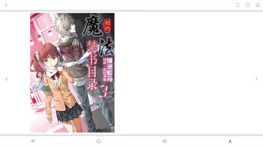

# 怡心阅读测试报告

## 后端部分测试

首先在PyCharm中打开“怡心阅读”文件夹，在manage.py文件的同级目录下创建“tests”文件夹，使用该文件夹存放测试用的python文件。创建tests文件夹完成之后，在该文件夹下创建testRegister.py文件编写测试类。

testRegister.py内容为：

```
from django.test import TestCase, Client
import json
from user.models import User
class RegisterTestCase(TestCase):
    def setUp(self):
        self.client = Client()
        self.url = '/user/register'

    def test_register_success(self):
        # 构造请求体数据
        data = {
            'username': 'test_user',
            'password': 'test_password',
            'ifManager': True
        }
        # 将请求体数据转为JSON格式
        data_json = json.dumps(data)
        # 发送POST请求
        response = self.client.post('http://127.0.0.1:8000'+self.url, data=data_json, content_type='application/json')
        # 断言响应状态码和返回的JSON数据
        self.assertEqual(response.status_code, 200)
        self.assertEqual(response.json(), {'result': 1, 'message': '注册成功!'})

    def test_register_username_exists(self):
        # 构造已存在的用户名
        existing_username = 'existing_user'
        # 构造请求体数据
        data = {
            'username': existing_username,
            'password': 'test_password',
            'ifManager': False
        }
        # 将请求体数据转为JSON格式
        data_json = json.dumps(data)

        # 先创建一个用户，模拟用户名已存在
        User.objects.create(username=existing_username, password='existing_password', ifManager=False)

        # 发送POST请求
        response = self.client.post(self.url, data=data_json, content_type='application/json')

        # 断言响应状态码和返回的JSON数据
        self.assertEqual(response.status_code, 200)
        self.assertEqual(response.json(), {'result': 0, 'message': '用户名已存在!'})

```

测试结果


注册模块测试完成。

| app | 系统操作         |               |                    |                            |  |                              |                              |                              |                              |                              |                              |
| ---- | ---------------- | ------------- | ------------------ | -------------------------- | ----------------------- | ---------------------------- | ---- | ---- | ---- | ---- | ---- |
| user | 注册（register） | 登录（login） | 退出登录（logout） | 修改用户信息（modifyUser） | 获取用户信息（getUser） | 获取管理员信息（getManager） |  |  |  |  |  |
| author | 添加作者（add_author） | 删除作者（delete_author） | 修改作者信息（edit_author） | 搜索作者（search_author） |      |      |      |      |      |      |      |
| book | 添加书籍（addbook） | 删除书籍（deleteBook） | 修改书籍信息（modifyBook） | 修改书籍受欢迎度（BookPopularityAdd） | 修改书籍评分（modifyScore） | 通过id获取书籍（getBookById） | 通过author获取书籍（getBookByAuthor） | 通过主要类型获取书籍（getBookByMainType） | 通过两种类型获取书籍（getBookByTwoType） | 关键词搜索书籍（searchBookByKey） | 获取书籍内容（getBookSource） |
| chapter | 添加章节（add_chapter） | 删除章节（delete_chapter） | 获取章节（get_chapter） |      |      |      |      |      |      |      |      |
| comment | 添加评论（add_comment） | 搜索评论（search_comment） |      |      |      |      |      |      |      |      |      |
| label | 添加书签（add_label） | 删除书签（delete_label） | 编辑书签（edit_label） | 搜索书签（search_label） |      |      |      |      |      |      |      |
| note | 添加笔记（create_note） | 查看笔记（view_all_note） | 更新笔记颜色（update_note_color） | 更新笔记内容（update_note_text） | 删除笔记（delete_note） | | | | | | |
| star | 添加收藏（add_star） | 删除收藏（delete_star） | 列出收藏（list_star） |  |  | | | | | | |

以上模块测试方法与register类似，均通过。


## 前端模块测试

对阅读器模块的人工手动测试结果如下：

进入阅读器界面，阅读器解析出epub格式的电子书，展示如下：点击左右两侧的按钮，可以上下翻页。



阅读器获取到数据库内的数据，展示出当前用户在此书范围内的阅读记录，包括书签、笔记。


点击字号调节按钮，出现字体调节菜单，可以通过滑块调节字体大小。


点击主题调节按钮，出现主题调节菜单，可以选择不同的主题。


点击进度显示按钮，可以查看目前的观看进度，并通过滑动调节当前页面位置。


点击目录按钮，可以查看书籍的目录，并通过点击目录跳转到对应章节。


点击上方菜单栏中的书签按钮后，会进入书签栏。点击左上角的+号可以在当前页面创建书签。


点击书签模块上的箭头可以跳转到对应书签的位置，点击书签模块上的叉号可以删除书签。


接下来测试笔记相关的功能。选中一个区域的文字后，菜单栏处会弹出笔记工具栏。


点击其中一个颜色，色块周围出现边框代表选中，且会给对应区域设置高亮。可以在各个颜色之间随意选择。若要撤销这次高亮操作，可以点击右侧的撤销按钮。


点击阅读器的中间部分或右侧的确认按钮，可以完成设置高亮笔记。用户的笔记可以在笔记栏内查看。内容包括高亮颜色，用户选择的内容和用户的笔记（可选）。


在选择高亮颜色的前提下点击右侧的笔记按钮，可以输入笔记。


在笔记栏内，可以修改笔记的内容。


已经被选中的范围再被选中之后，颜色可以修改而不会叠加。


与label相同，点击笔记上的箭头可以跳转到对应的页面，点击笔记上的叉号可以删除笔记。
