# 用户使用说明书

## 用户部分

### 1.登录功能——使用用户名和密码登录

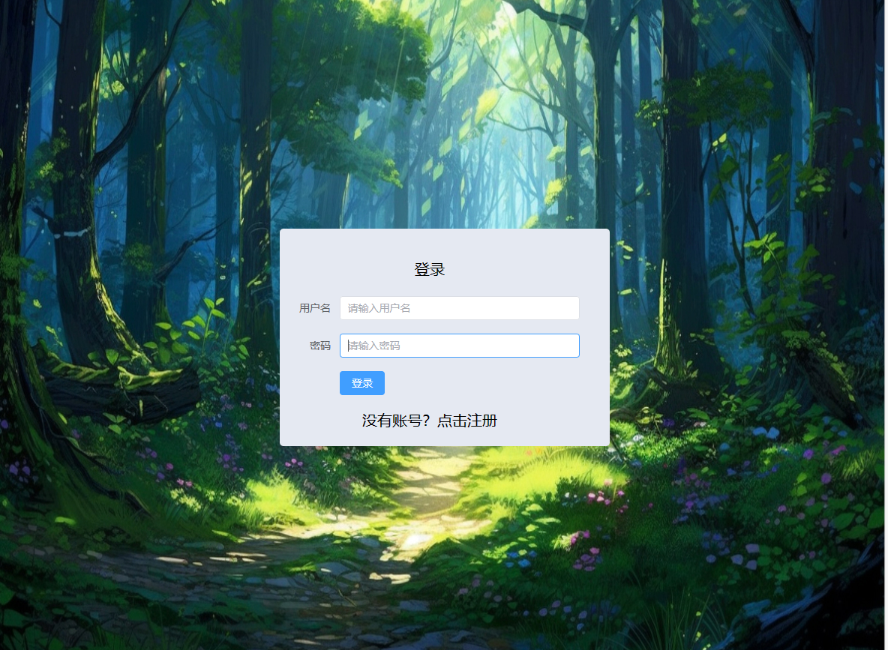

### 2.注册功能——注册成为用户

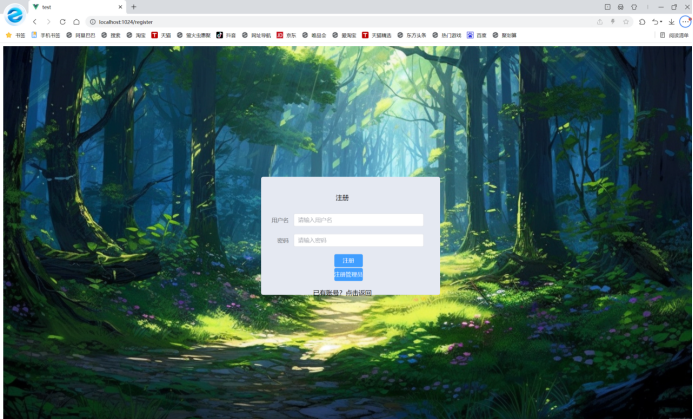

### 3.登录后进入首页

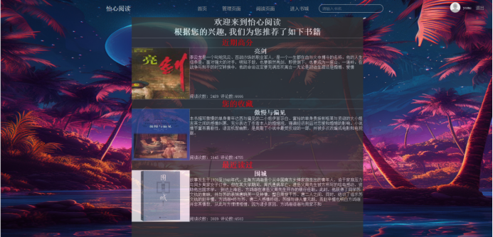

### 4.修改个人信息——修改用户名、性别后点击保存

### 5.进入书城——首页点击“进入书城”

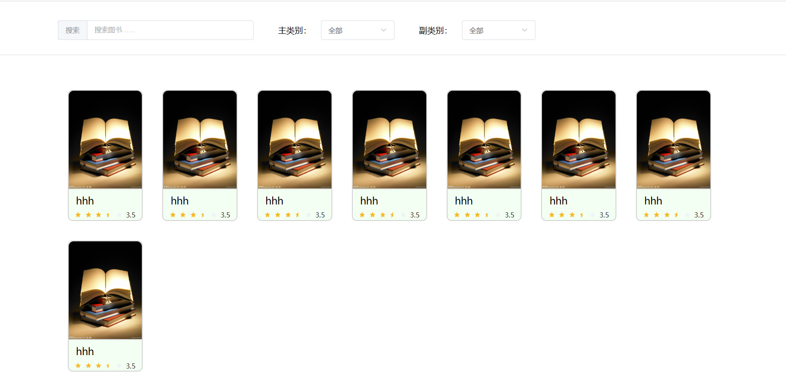

### 6.使用关键词搜索书籍——可选书籍主类别和副类别

### 7.进入书籍详情页面——书城界面点击一本书

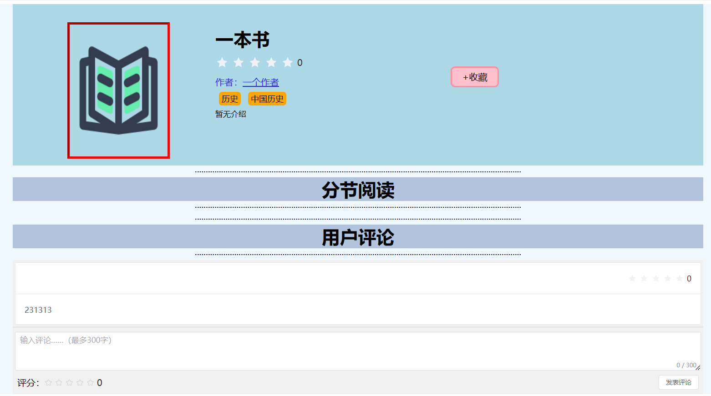

### 8.收藏书籍——点击收藏按钮

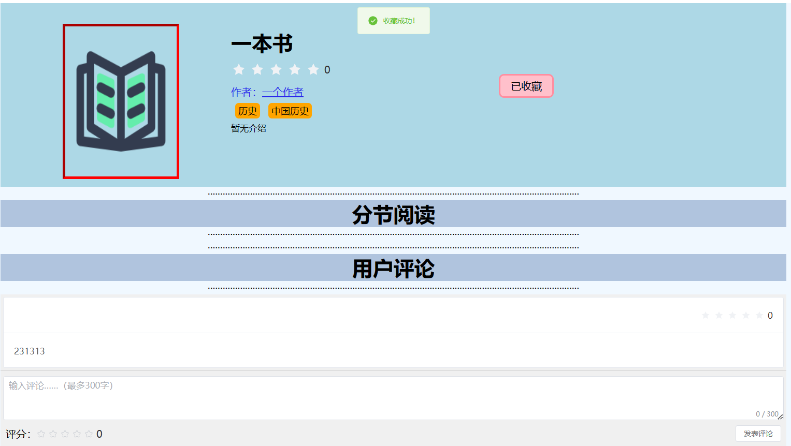

### 9.发表评论——在评论栏输入评论内容，也可为书籍打分

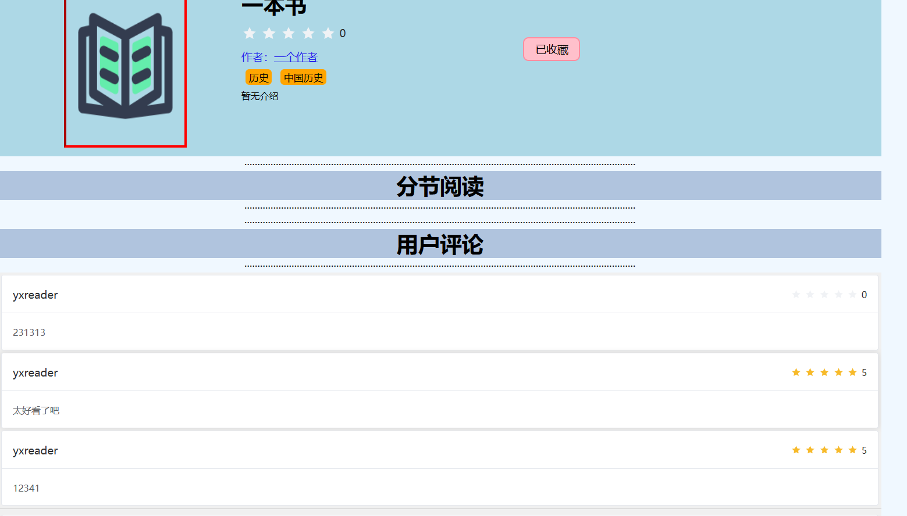

### 10.查看收藏书籍列表——个人信息界面点击“我的收藏”

### 11.查看作者界面——在书籍界面点击作者信息

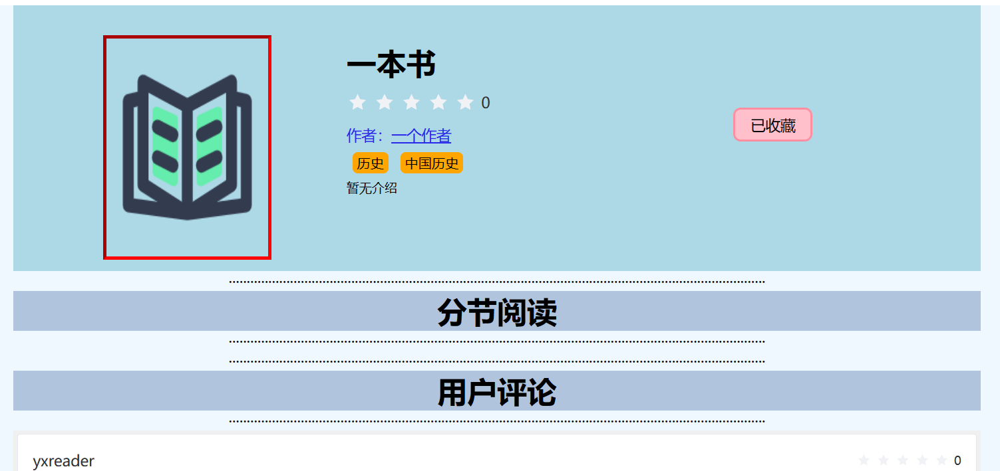

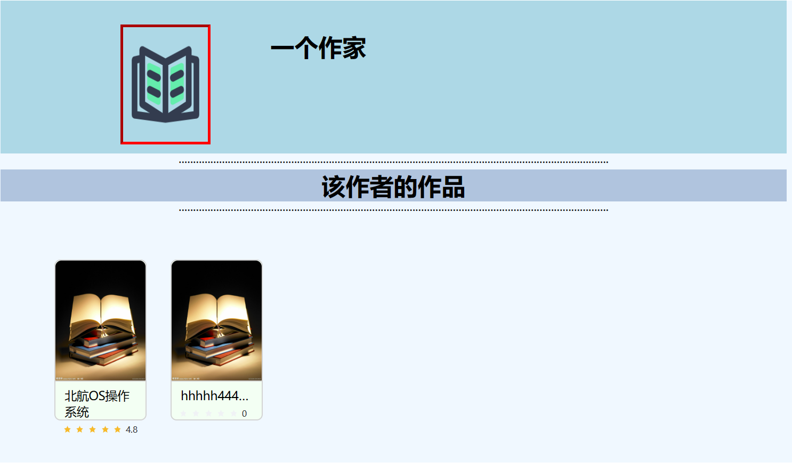

### 12.查看作者的书籍——在作者界面点击书籍，进入书籍详情界面

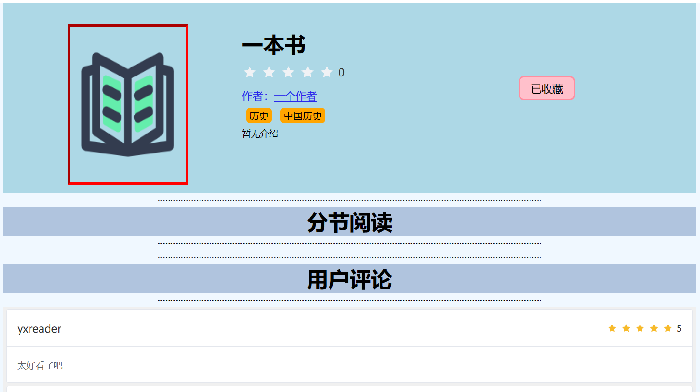

13.阅读功能

* 进入阅读器

* 拖动滑块调整字号

  

  

* 调节主题

  

  
  
* 查看进度，滑动调节页面

  

* 查看目录

  

* 点击加号创建书签

  

* 点击”ד删除书签

  

* 选中文字，添加笔记（可设置高亮）

  
  
* 修改笔记

  

* 修改笔记颜色

  

## 管理员部分

### 1.添加书籍——管理界面点击“添加图书”

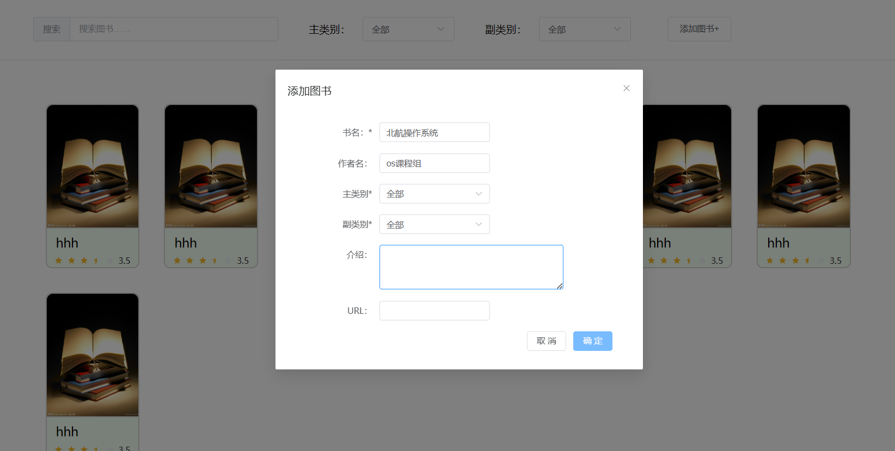